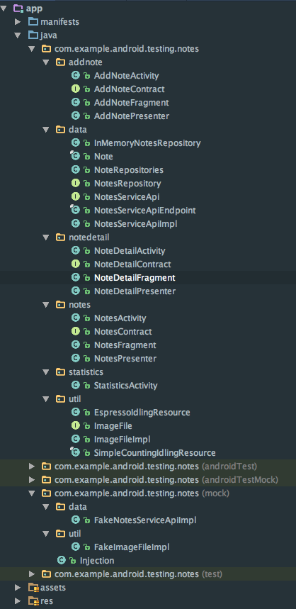

# Android Test Note

## References

1. [Android Testing Codelab](https://codelabs.developers.google.com/codelabs/android-testing/index.html)
1. [在 Android Studio 中进行单元测试和 UI 测试](http://www.jianshu.com/p/03118c11c199)，[Origin](https://io2015codelabs.appspot.com/codelabs/android-studio-testing)
1. [Android 单元测试](https://github.com/ChrisZou/android-unit-testing-tutorial)
1. [Unit Testing with JUnit - Tutorial](http://www.vogella.com/tutorials/JUnit/article.html)
1. [Unit tests with Mockito - Tutorial](http://www.vogella.com/tutorials/Mockito/article.html)

## Note 1

Note for [Android Testing Codelab](https://codelabs.developers.google.com/codelabs/android-testing/index.html)

这个例子中的示例工程是个代码组织极好的典范，值得深入研究。实际从这个 Codelab 关于测试的内容收获不多，比如 Mockito 只是一带而过，没有介绍如何使用它，反而是加深了对 MVP，Repository 模式，以及 Contract 类的理解。

传统的 MVC 是不方便用来测试的，如果要方便测试，比较适合的模式就是 MVP。

代码结构：

1. Repository 广义上属于 MVP 中的 M - Model，它向 Presenter 屏蔽了底层操作 (获取，存储) data (即狭义的 model) 的细节，Repository 定义了操作 data 的接口，然后由不同的具体的 Repository 实现类来实现这些方法。

1. 在 Repository 中调用网络 API 获取数据，或者从数据库读取数据。Presenter 只与 Repository 交互，Repository 相当于 Model 层的对外接口。

1. Contract 类只是简单地把 IView 和 IPresenter 的定义包装在一起，实际上并不是必需的，但它使代码更简洁，避免了多定义一个文件，也减少了命名的烦恼。

1. 在 UI 占主导的客户端 MVP 中，一般来说，V 是入口，因此 V 是主导，因此，一般先有 V，然后由 V 来生成 P，在此例中，甚至由 V 来生成具体的 Repository，并注入到 P 中。而对于服务端 (服务端的 MVC 更像是 MVP) 来说，一般是 P 占主导，先有 P，再由 P 来生成 V。

1. 在 MVP 中，V 和 P 相互引用，直接调用对方的方法，而 P 和 M (在此例中，M 指 Repository)，P 持有 M 的引用，P 直接调用 M 的方法，但 M 直接在方法中，通过参数中的回调接口通知 P，因此，它并不需要持有 P 的引用。比如此例中 NotesRepository 的定义：

       public interface NotesRepository {
           interface LoadNotesCallback {
               void onNotesLoaded(List<Note> notes);
           }

           interface GetNoteCallback {
               void onNoteLoaded(Note note);
           }

           void getNotes(@NonNull LoadNotesCallback callback);

           void getNote(@NonNull String noteId, @NonNull GetNoteCallback callback);

           void saveNote(@NonNull Note note);

           void refreshData();
       }

1. 这个工程按功能分包，而不是按代码类别分包。

1. `Injection.provideNotesRepository()`，注入的手动实现

1. 使用 Falvor，在不同的环境下 (mock 和 prod)，通过 `Injection.provideNotesRepository()` 得到不同的 Repository 实现类。

## Note 2

Note for [在 Android Studio 中进行单元测试和UI测试](http://www.jianshu.com/p/03118c11c199)，[Origin](https://io2015codelabs.appspot.com/codelabs/android-studio-testing)

照着例子练习了一下，虽然是个极简单的例子，也遇到不少坑，最大的坑是，例子中测试在输入框中输入 "Peter"，注意首字母是大写，然而在我的手机上跑测试时，无法输入大写字母 (我也不知道为什么)，导致测试失败，而报的错误信息也很误导人，试了很久才发现是这个问题，把 "Peter" 改成 "peter" 后再能成功。

    Caused by: junit.framework.AssertionFailedError: 'with text: is "Hello, Peter!"' doesn't match the selected view.
    Expected: with text: is "Hello, Peter!"
    Got: "AppCompatTextView{id=2131427422, res-name=textView, visibility=VISIBLE, width=278, height=76, has-focus=false, has-focusable=false, has-window-focus=true, is-clickable=false, is-enabled=true, is-focused=false, is-focusable=false, is-layout-requested=false, is-selected=false, root-is-layout-requested=false, has-input-connection=false, x=64.0, y=64.0, text=Hello, pete!, input-type=0, ime-target=false, has-links=false}"

通过这个例子，对 android 下的测试有了一个比较大概的理解。

首先，代码测试 (与黑盒白盒的手动测试区分) 一般分两种：

- 单元测试
- 功能测试，或者也叫集成测试

单元测试是只对一个单独的 public 的方法进行测试，这是我们测试的重点，应该占所有测试的 70% 以上。而功能测试，是对一个功能进行完整地测试，其中包含了涉及此功能的多个方法的调用。

功能测试是单元测试的超集，所用的技术和框架没有太大区别。

对于 Android 的单元测试和功能测试内部，又细分两种：

- 非 android framework api 相关的方法的测试 (又称 local test)
  - 在 JVM 上跑，不需要模拟器或设备
  - 用到技术或框架：JUnit4，Mockito
  - 在 `test` 目录下
  - 命令行命令：`./gradlew test`
- 与 android framework api 相关的方法的测试 (又称 instrumented test)
  - 需要运行在模拟器或设备上
  - 用到技术或框架：Espresso
  - 在 `androidTest` 目录下
  - 命令行命令：`./gradlew cAT` (cAT - connect Android Test)

android framework api 指的是像 android 四大组件，view 等的方法。

对于非 android framework api 相关的方法的测试，我们用 JUnit4 和 Mockito 就够了，Mockito 用来 mock 对象，比如在 MVP 中，我们对 P 进行单元测试时，需要用 Mockito 来 mock V 和 M。

测试的目标方法分两种

- 有返回值的方法：直接用 JUnit 的 `assertEquals` 系列方法判断返回值是否与预期相符
- 没有返回值的方法：使用 Mockito 判断某些 mock 对象的方法是否被调用了

对 android framework api 相关的方法的测试 (比如对 Activity 的方法进行测试)，由于测试时需要连接手机或模拟器，比较麻烦，暂时略过吧。使用的框架是 Google 官方提供的 Espresso。也有第三方提供的 Robolectric 框架，可以不需要设备，支持直接在 JVM 上跑，但应该也不简单。

所以对 Android 的测试，我们重点只关注对非 android framework api 相关的方法的单元测试，重点掌握 JUnit 和 Mockito 的使用就行。

## Note 3

Note for [Android 单元测试](https://github.com/ChrisZou/android-unit-testing-tutorial)

**(一) 基本**

单元测试只对 public 方法进行测试。

一个方法对应的测试方法主要分为 3 部分：setup，执行操作，验证结果。

单元测试不是集成测试，Test Pyramid 理论，单元测试是基础，是我们应该花绝大多数时间去写的部分，而集成测试等应该是冰山上面能看见的那一小部分。

> 集成测试设置起来很麻烦，运行起来很慢，发现的 bug 少，在保证代码质量、改善代码设计方面更起不到任何作用，因此它的重要程度并不是那么高，也无法将它纳入我们正常的工作流程中。

> 而单元测试则刚好相反，它运行速度超快，能发现的bug更多，在开发时能引导更好的代码设计，在重构时能保证重构的正确性，因此它能保证我们的代码在一个比较高的质量水平上。同时因为运行速度快，我们很容易把它纳入到我们正常的开发流程中。

两种函数，两种不同的测试方式：

1. 有返回值：JUnit
1. 无返回值：Mockito

**(三) JUnit 的使用**

setup：

- `@Before`，`@After`：每一个测试方法之前或之后都会执行的
- `@BeforeAll`, `@AfterAll`：测试类的静态方法，在所有测试方法执行之前或之后会执行一次

测试方法用 `@Test` 注解

验证结果：`assert` 系列方法，`fail()`

Ignore 一些测试方法：`@Ignore("not implement yet")`

验证抛出异常：`@Test(expected = IllegalArgumentException.class)` (要是抛出多个异常呢?)

**(四) Mock 及 Mockito 的使用**

Mockito 是 Java 界使用最广泛的 mock 框架。

    @Test
    public void testLogin() throws Exception {
        UserManager mockUserManager = Mockito.mock(UserManager.class);

        LoginPresenter loginPresenter = new LoginPresenter();
        loginPresenter.setUserManager(mockUserManager);  //<==

        loginPresenter.login("xiaochuang", "xiaochuang password");

        Mockito.verify(mockUserManager).performLogin("xiaochuang", "xiaochuang password");
    }

在测试过程中，你就会发现依赖注入是多么有用！

Mockito 的两大作用：

1. 验证方法调用，如上例所示
1. 指定 mock 对象的某此方法的行为
   - 指定某个方法返回特定的值
   - 指定执行特定的动作

验证方法调用中，还可以调试方法被调用了多少次，最多或至少调用了多少次，以及不关心参数时，可以使用 `Mockito.anyString()` 系列方法。具体看文档。

    Mockito.verify(mockUserManager, Mockito.times(3)).performLogin(Mockito.anyString()...)

Mockito 的 Spy 功能，略。

其余略，需要时再看文档，或者 [Unit tests with Mockito - Tutorial](http://www.vogella.com/tutorials/Mockito/article.html)

**(五) 依赖注入，将 mock 方便的用起来**

DI (Depedency Inject) 的思想其实很简单，别想太复杂，简单地说，就是把原来在类内部生成的对象，放到类外部来生成，再传递给这个类。

把类外部生成的对象传递到类内部的常见实现方式：

1. Setter Injection：通过 setter 函数
1. Argument Injection：放在每个方法的参数中

       public void login(UserManager userManger, String username, String password) {...}

1. Constructor Injection：放到构造函数的参数中

       public class LoginPresenter {

           private final UserManager mUserManager;

           //将UserManager作为构造方法参数传进来
           public LoginPresenter(UserManager userManager) {
               this.mUserManager = userManager;
           }

           public void login(String username, String password) {
               //... some other code
               mUserManager.performLogin(username, password);
           }
       }

方法三是我们最常用的。

如果一个类的构造函数参数过多，往往说明这个类的设计是有问题的，需要重构。

我们代码里面的类，一般可以分为两种，一种是 Data 类，比如说 UserInfo，OrderInfo 等等。另外一种是 Service 类，比如 UserManager, AudioPlayer 等等。所以这个问题就有两种情况了：

- 如果 Constructor 里面传入的很多是基本类型的数据或数据类，那么或许你要做的，是创建一个 (或者是另一个) 数据类把这些数据封装一下，这个过程的价值可是大大滴！而不仅仅是封装一下参数的问题，有了一个类，很多的方法就可以放到这个类里面了。这点请参考 Martin Fowler 的《重构》第十章 “Introduce Parameter Object”。

- 如果传入的很多是 Service 类，那么这说明这个类做的事情太多了，不符合单一职责的原则 (Single Responsibility Principle，SRP)，因此，需要重构。

**(六) 使用 Dagger2 来做依赖注入**

再次复习 Dagger2。

这篇文章写得超 NB，应该是我现在所看到写 Dagger2 最深入的文章了，值得多看几遍。

- Module：生产 Dependency 的工厂，具体类，`@Module`，`@Provides`
- Component：工厂管理员，接口类，`@Component`
- Container：需要被注入的对象，`@Inject`

**(七) Robolectric，在 JVM 上调用 Android 的类**

Android 的单元测试为什么不好意，是因为一旦涉及到调用 android framework 的 api 时，比如四大组件的方法，view 的方法，就需要跑在摸拟器或设略过才可以，在设备上才有 android framework 的 api 的真正实现，在 jvm 上跑时，本地的 android.jar 中 api 的实现都是直接抛出异常。

而 Robolectric，他们的做法是通过实现一套 JVM 能运行的 Android 代码，然后在 unit test 运行的时候去拦载 android 相关的代码调用，然后转到他们自己实现的代码去执行这个调用的过程。

Robolectric 可以用来替代官方的 Espresso 测试框架 (但肯定有一些坑的)。

**(八) JUnit Rule 的使用**

在测试类中可以用 `@Rule` 注解一个实现了 TestRule 接口的类对象，这个类对象可以在每个测试方法之前或之后执行一些操作，相当于这一个类对象就实现了 `@Before` 和 `@After` 的功能。(像是一种 hook，插桩? 让我想起了面向切面编程。)

它相比单独写 `@Before` 和 `@After` 的好处在于，这样实现的一个类，可以在不同的测试类中使用，而不用再写一遍 `@Before` 和 `@After` 方法。

**(九) 使用 Mockito Annotation 快速创建 mock 对象**

前面的文章中我们手动调用 `Mockito.mock(YourClass.class)` 方法来生成 mock 对象，实际上我们可以使用 `@Mock` 注解来声明需要 mock 的对象，并在 `@Before` 中调用 `MockitoAnnotations.initMocks()` 来一次性生成所有的 mock 对象。以下代码摘自 Note 1 中的示例工程：

    public class NotesDetailPresenterTest {
        @Mock
        private NotesRepository mNotesRepository;

        @Mock
        private NoteDetailContract.View mNoteDetailView;

        @Before
        public void setupNotesPresenter() {
            // Mockito has a very convenient way to inject mocks by using the @Mock annotation. To
            // inject the mocks in the test the initMocks method needs to be called.
            MockitoAnnotations.initMocks(this);

            // Get a reference to the class under test
            mNotesDetailsPresenter = new NoteDetailPresenter(mNotesRepository, mNoteDetailView);
        }

        @Test
        public void getNoteFromRepositoryAndLoadIntoView() {
            ...
        }
    }

在前一篇文章中我们也讲到可以使用 TestRule 来替代 `@Before`。Mockito 自带了一个 MockitoRule 就实现了 `MockitoAnnotations.initMocks()` 功能。所以上面的代码也可以这样实现：

    public class NotesDetailPresenterTest {
        @Rule
        public MockitoRule mockitoRule = MockitoJUnit.rule();

        @Mock
        private NotesRepository mNotesRepository;

        @Mock
        private NoteDetailContract.View mNoteDetailView;

        @Before
        public void setupNotesPresenter() {
            // Get a reference to the class under test
            mNotesDetailsPresenter = new NoteDetailPresenter(mNotesRepository, mNoteDetailView);
        }

        ...
    }

Mockito 的其它使用方法之后再学习吧。

**(十) DaggerMock**

暂略，对 Dagger2 和 Mockito 进行了封装，简化使用。

**(十一) 异步代码怎么测试**

两种思路：一是等异步代码执行完了再执行 assert 操作，二是将异步变成同步。

详情略，需要时再回头看。

**Android单元测试在蘑菇街支付金融部门的实践**

算是上面所有文章的总结。详细，需要时再细看。
